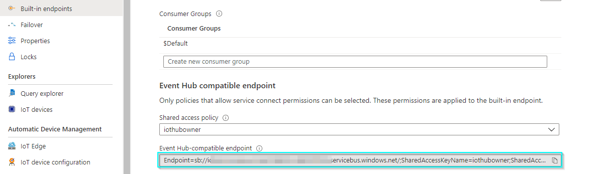

# End-to-End Industrial IoT (IIoT) on Azure Databricks

And End-to-End Industrial IoT Pipeline Using Azure Databricks, Azure Data Explorer and more.

## Overview

This repository demonstrates the following architecture for **IIoT Ingest, Processing and Analytics** on Azure: <br><br>

<div style="text-align:left"></div><br><br>

The demonstration is broken into sections following these steps **1** - **7**:

#### `Step 1`: Configure Simulator to send Iot Data to Event Hub

Link to Simulator [here](https://azure-samples.github.io/raspberry-pi-web-simulator/) - sends **temperature** and **motor** data.

#### `Step 2`: Data Ingest from Event Hubs

We leverage the native Spark connector for Event Hubs to access the Streaming Data.

#### `Step 3`: Perform Stream Processing to formulate Tables on Data Lake

We leverage various Data Engineering techniques here - all performing Streaming Transformations.

#### `Step 4`: Machine Learning and Prediction

We look into predicting **power output** and **remaining life**.

#### `Step 5`: Data Serving and Visualization - `Power BI`

We use the processed data for visualization.

#### `Step 6`: Rule based alerting - see `2.Real-Time-Alerting-Demo`

Performing Stream-Static joins to implement custom rule-based alerting.

#### `Step 7`: Operational querying - `Azure Data Explorer`

Using **Azure Data Explorer** to perform operational querying.

## Deployment steps

---

Here are the Azure services we need to deploy. Any configuration changes besides the default configurations are highlighted below as well:<br>

<div style="text-align:left"></div><br>

💡 **Note**: we are only using IoT Hub here since the simulator used sends data to IoT Hubs. For our purposes, it’s essentially an Event Hub, since in the Spark Streaming Job, we connect to IoT Hub’s built in [Event Hub](https://docs.microsoft.com/en-us/azure/iot-hub/iot-hub-devguide-messages-read-builtin) endpoint.

### Environment setup

1. Create a new Azure **Resource Group** (or use an existing one if you like).
2. Deploy an **Azure Databricks** service from the Azure Marketplace, with **Premium** selected (for our purposes, the cost will be miniscule but we'll get the full service experience).

3. Deploy an **IoT Hub** with default settings.

4. Deploy an **Event Hub Namespace** with the following changes made to the default:

   - **Pricing tier**: `Standard`

5. Deploy a **Storage Account** with the following changes made to the default:

   - **Advanced > Hierarchial namespace**: Enabled [(benefits of why this is a good idea is listed here)](https://docs.microsoft.com/en-us/azure/storage/blobs/data-lake-storage-namespace#the-benefits-of-a-hierarchical-namespace)

6. Deploy **Azure Data Explorer** with the following changes made to the default:

   - **Pricing tier**: `Dev/test` (it's all we need for our data volume)
   - **Configurations > Streaming ingestion**: `On` (we'll need this to pull data from our **IoT Hub** and **Event Hub** Topic [details here)](https://docs.microsoft.com/en-us/azure/data-explorer/ingest-data-streaming?WT.mc_id=Portal-Microsoft_Azure_Kusto)

7. Deploy a **Logic App** with default settings.

At this point - your Resource Group should look something like this:<br>
<br>

We'll now perform `Step 1: Configure Simulator to send Iot Data to Event Hub` from the Architecture Diagram.

8. Navigate to the [Raspberry Pi Azure IoT Online Simulator](https://azure-samples.github.io/raspberry-pi-web-simulator/). This is a `node.js` app that sends data to IoT Hub, based on the schema we specify in code.

9. In your IoT Hub, navigate to **IoT devices** from the sidebar:

   - Click **New**
   - **Device ID**: `databricks-iot-device` (this can be anything - it's pointed to the simulator)
   - Click **Save**

Once that's done, copy this key:


10. Take the script located in this repo [1.IoT-Simulator/azure_iot_simulator.js](1.IoT-Simulator/azure_iot_simulator.js) and replace `line 15` with the Key you copied:

`const connectionString = 'HostName=<your--iot--hub>.azure-devices.net;DeviceId=<your--iot--hub--device--name>;SharedAccessKey=<your--access--key>';`

11. Paste this code in the Simulator, and click run. You should see devices being sent from the Simulator, to your IoT Hub. There's two unique streams being generated here, that we'll parse out on the Spark side:


12. In the Azure Storage Account we created, create a new container called `iot`:

<div style="text-align:left"></div><br>

This will basically going to be our Data Lake. Spark is going to create Streaming tables here as we ingest data in, tables we'll be able to query with `SQL` syntax (i.e. like a database).

13. Copy the Storage Account Key from Azure Portal - we'll need to paste this in Databricks so it can store data in our Storage Account.

<div style="text-align:left"></div><br>

14. In the IoT Hub we created, we need to grab the Event Hub compatible connection string, for Spark to connect to the Stream of events we're sending from our Simulator - details [here](https://docs.microsoft.com/en-us/azure/iot-hub/iot-hub-devguide-messages-read-builtin#read-from-the-built-in-endpoint).

Copy this Connection String from Azure Portal - we'll need to paste this into Databricks so it can pull data from our Topic.

<div style="text-align:left"></div><br>

15. Navigate to the Azure Dataricks Service, and click `Launch Workspace`: <br><br>

<div style="text-align:left"></div><br>

16. From the left hand sidebar, navigate to `Clusters > Create Cluster`:
<div style="text-align:left"></div><br>

Create a Cluster with the following settings:

- **Cluster Name**: `Stream Ingestion | 01 `
- **Databricks Runtime Version**: `7.5 ML` (no need for GPU)
- Disable autoscaling (our data is small)
- Terminate after `120` minutes of inactivity (we want to save costs when not using the environment)
- Worker Type: `Standard_DS3_v2, 3 workers`

The setup should look like this:

<div style="text-align:left"></div><br>

This is the Spark Cluster that'll run our Notebooks (which are Spark Jobs). We can have multiple notebooks per Cluster - Databricks handles the Spark job orchestration/resource management overhead etc.

17. Once the Cluster is deployed - we'll see a Green dot besides the name (meaning it's ready to use). Before we start, we install the Event Hub package from Maven [link](https://mvnrepository.com/artifact/com.microsoft.azure/azure-eventhubs-spark_2.12/2.3.17) that lets Spark connect to our IoT Hub.

To do this:

- Go to `Libraries > Install New`
- Select `Maven`
- Under Coordinates enter `com.microsoft.azure:azure-eventhubs-spark_2.12:2.3.17`
- Click `Install`

Databricks will install the Package from Maven on our Cluster, looking something like this:

<div style="text-align:left"></div><br>

18. Create a new folder called `IoT Pipeline` in the Databricks workspace, where we'll be importing our two notebooks. <br><br>

<div style="text-align:left"></div><br>

19. Download the 2 Notebooks available in this repo [2.Databricks-Notebooks](2.Databricks-Notebooks) - we're going to import them into our Databricks Workspace.

20. Import the 2 Notebooks into the folder we created:

<div style="text-align:left"></div><br>

After the import:

<div style="text-align:left"></div><br>

21. Navigate to `1.IIoT-End-to-End` - note that the run results from the export are still visible. To Clear this, select `Clear State & Results` to start on a clean slate (this doesn't impact our pipeline).

<div style="text-align:left"></div><br>

22. Perform the following localizations to align with your environment:

    - In the top widget, enter in the name of your IoT (i.e. _not_ the Event Hub, but the IoT Hub the simulator is sending data to) Hub and Storage Account, while also attaching the notebook to our Cluster:
    <div style="text-align:left"></div><br>

    - In `Cmd 5` - enter in the two Keys (IoT Hub's EH Key, Storage Key) we copied earlier:
    <div style="text-align:left"></div><br>

23. The notebook is now ready to run. Click `Run All`:

<div style="text-align:left"></div><br>

After a few minutes of initial setup, the pipeline will run end-to-end, resembling something like this:


At this point, the various Streaming queries will run continuously until we stop the notebook. We can go to the following commands and re-run the queries, to see more data as it's flowing in from our Event Hub:

- `Cmd`: 14, 19, 23 etc.

We have now completed the following Steps from the Architecture Diagram:

- `Step 2`: Data Ingest from Event Hubs
- `Step 3`: Perform Stream Processing to formulate Tables on Data Lake
- `Step 4`: Machine Learning and Prediction

For `Step 5`: Data Serving and Visualization - `Power BI`, Install [Power BI Desktop](https://powerbi.microsoft.com/en-us/downloads/) and open the `.pbix` file included with this repo [3.PowerBI-Report/Turbine Analysis.pbix](3.PowerBI-Report)

24. We want to now generate an Access Token so Power BI can connect to our Spark Cluster, and use it to visualize data.

To create a Personal Access Token, follow the steps [here](https://docs.databricks.com/dev-tools/api/latest/authentication.html)

<div style="text-align:left"></div><br>

Grab the Unique Cluster endpoint from your Databricks Cluster:

<div style="text-align:left"></div><br>

Generate the full Endpoint String, which will look like this:

`https://canadacentral.azuredatabricks.net:443/sql/protocolv1/o/5202278000067542/0128-143037-loner853`

Follow the steps [here](https://community.powerbi.com/t5/Community-Blog/Why-can-t-I-change-the-Data-Source-in-Power-BI-disabled-button/ba-p/915365) to point the Power BI report's Data Sources to run against your Databricks Cluster and Token.

We now have our Power BI Interactive Report running against our live dataset:


Proceeding onto `Step 6: Rule based alerting` - we begin by creating an Event Hub Topic that will queue up our Alarms data.

25. Navigate to your Event Hubs Namespace, create a new Event Hub named `alarms` with default settings. Create a [Shared Access Policy](https://docs.microsoft.com/en-us/azure/event-hubs/authorize-access-shared-access-signature#shared-access-authorization-policies) from the portal named `manage` as well.

Make a note of the following for our notebook:

- `<your--event--hub--endpoint>`: e.g. `aia-iot-demo-kafka-clone`
- `<your--sas--key--name>`: e.g. `manage`
- `<your--sas--key>`: e.g. `TQaG6sD4vaFBq***************VPU=`

```scala
val BOOTSTRAP_SERVERS = "<your--event--hub--endpoint>.servicebus.windows.net:9093"
val EH_SASL = "kafkashaded.org.apache.kafka.common.security.plain.PlainLoginModule required username=\"$ConnectionString\" password=\"Endpoint=sb://<your--event--hub--endpoint>.servicebus.windows.net/;SharedAccessKeyName=<your--sas--key--name>;SharedAccessKey=<your--sas--key>\";"
```

26. Create a new folder named `rules` in the `iot` container, and drop in `alert-rules.csv` available in this repository [4.alert-rules/alert_rules.csv](4.alert-rules/alert_rules.csv):

<div style="text-align:left"></div><br>

27. To leverage the `Logic App > Teams` component of this demo, leverage the `json` file available in this repo [5.logic-app/logic-app.json](5.logic-app/logic-app.json) - into here:


💡 **Note:** We skipped the part about setting up a Teams channel etc - not really relevant since the Notification Sink can vary (logic app has a [ton of connectors](https://docs.microsoft.com/en-us/connectors/connector-reference/connector-reference-logicapps-connectors))

28. We import Notebook 2 `2.Real-Time-Alerting-Demo.html`.

29. Perform the following localizations to align with your environment:

    - In the top widget, enter in the name of your Storage Account (same as Notebook 1), while also attaching the notebook to our Cluster.

    - In `Cmd 5`, line `1` - enter in the Storage Key we copied earlier.
    - In `Cmd 16`, enter in the various settings from your **Event Hub** (not the IoT Hub, but the Event Hub)we obtained in Step 25 above.

30. The notebook is now ready to run. Click `Run All`:


💡 **Note:** The `alert_rules.csv` probably needs to be modified for your environment, since it was tweaked to generate a few alarms for the randomized dataset my simulator created.

We proceed onto the final step `Step 7: Operational querying - Azure Data Explorer`. We're going to set up ingestion pipelines for ADX to ingest data from our IoT Hub Topic (from Simulator), and Event Hub Topic (for alarms).

We first setup a database called `iot` on our ADX Cluster:

<div style="text-align:left"></div><br>

31. **IoT Hub** Follow the Steps [here](https://docs.microsoft.com/en-us/azure/data-explorer/ingest-data-iot-hub#create-a-target-table-in-azure-data-explorer) to create the Target ADX tables, using the `DDL` syntax below for our IoT Stream:

```sql
.create table iot_stream (timestamp: datetime, deviceId: string, temperature: double, humidity: double, windspeed: double, winddirection: string, rpm: double, angle: double, eventdate: date)
.create table iot_stream ingestion json mapping 'iot_streamMapping' '[{"column":"timestamp","path":"$.timestamp","datatype":"datetime"}, {"column":"deviceId","path":"$.deviceId","datatype":"string"}, {"column":"temperature","path":"$.temperature","datatype":"double"}, {"column":"humidity","path":"$.humidity","datatype":"double"}, {"column":"windspeed","path":"$.windspeed","datatype":"double"}, {"column":"winddirection","path":"$.winddirection","datatype":"string"}, {"column":"rpm","path":"$.rpm","datatype":"double"}, {"column":"angle","path":"$.angle","datatype":"double"}, {"column":"eventdate","path":"$.date","datatype":"date"}]'

```

This essentially creates our Target tables in ADX, and maps the `JSON` data from the Event Topic, to the target table. Once this is done, we see the resulting table and mapping in ADX:

<div style="text-align:left"></div><br>

Follow the Steps [here](https://docs.microsoft.com/en-us/azure/data-explorer/ingest-data-iot-hub#connect-azure-data-explorer-table-to-iot-hub) to connect the IoT Hub to ADX, screenshot looks like this:

<div style="text-align:left"></div><br>

The highlighted sections correspond to the Table and mapping we create earlier via `DDL` Statements.

💡 **Note:** Make sure to create a new **Consumer Group** for ADX to read from IoT Hub (otherwise the Spark pipeline will fail because they'll compete). To do this, run the following [command](https://docs.microsoft.com/en-us/cli/azure/iot/hub/consumer-group?view=azure-cli-latest) from Azure Powershell:

```bash
az iot hub consumer-group create --hub-name <your--iot--hub--name> --name adx
```

Once created, wait a few minutes, and data will start to flow into ADX automatically from the IoT Hub Topic.

We can navigate to the ADX Explorer at this [link](https://dataexplorer.azure.com/). We can run queries against our Streaming Table using `KQL` syntax:

```KQL
// weather_raw
iot_stream
| where isnotnull(temperature)
| project timestamp, deviceId , temperature, humidity, windspeed, winddirection

// turbine_raw
iot_stream
| where isnull(temperature)
| project timestamp, deviceId , rpm , angle
```

We see:

<div style="text-align:left"></div><br>

32. Repeat the steps above for the Event Hub Alarm Topic as well, following the steps [here](https://docs.microsoft.com/en-us/azure/data-explorer/ingest-data-event-hub). The required `DDL` statements are included in this repo [6.adx-queries/adx_create_table.kql](6.adx-queries/adx_create_table.kql)

That's all 7 steps! Happy Streaming!

🚀 **Note**: Feel free to open an Issue if any of the steps don't work/make sense!
